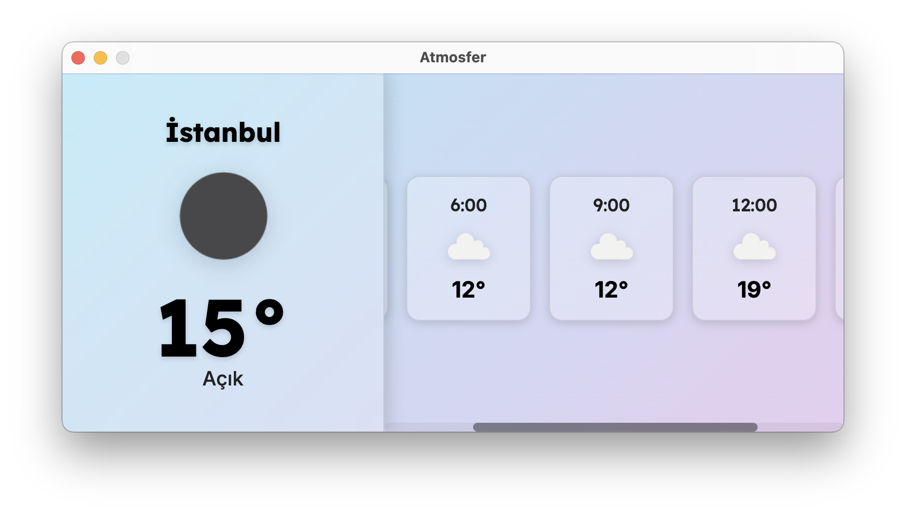

# Atmosfer - Minimalist Weather Widget

A stylish, horizontal desktop weather widget built with Electron.

This application displays the current weather information and the next 5-hour forecast on a live, animated gradient background with a "glassmorphism" (glass effect) UI.

## ✨ Key Features

Horizontal Design (700x350): Offers a modern look on the desktop.

Current Weather: The left panel shows the current temperature, status, and a large icon.

5-Hour Forecast: The right panel lists the forecast for the next 5 hours (in 3-hour intervals) in a scrollable area.

Live Background: Features a constantly moving animated gradient background in lilac and pink tones.

Glassmorphism UI: Elements sit modernly on the background using a semi-transparent and blurred 'glass' effect.

API Integration: Fetches data from the OpenWeatherMap API.

## 🛠️ Tech Stack

Electron: To build the cross-platform desktop application.

Vanilla JavaScript (ES6+): For all application logic (no framework used).

CSS3: For all styling, animated gradients, flexbox layout, and the 'glassmorphism' effect.

Axios: To make requests to the OpenWeatherMap API.

This project is a personal study created to learn Electron and API integrations.
by nora...
